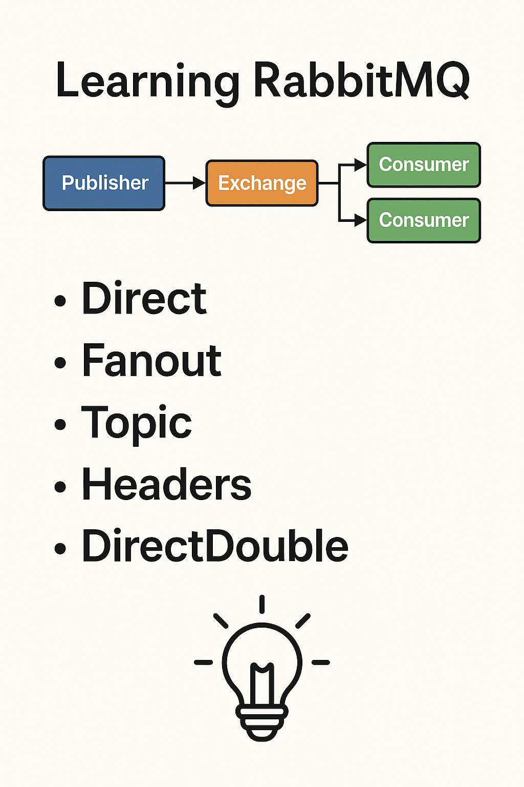

# 🧪 Learning RabbitMQ

Welcome to the **Learning-RabbitMQ** repository!  
This repo serves as a practical sandbox for understanding and experimenting with different RabbitMQ messaging patterns including **Direct**, **Fanout**, **Topic**, **Headers**, and their combinations.



## 🧰 What’s Inside

Each folder covers a specific messaging pattern with minimal setup and examples.

| Folder          | Description                                                                 |
|-----------------|-----------------------------------------------------------------------------|
| `direct/`       | Demonstrates simple direct exchange routing using routing keys.             |
| `directDouble/` | Uses multiple direct queues with different bindings (like sub/unsub mails). |
| `fanout/`       | Broadcasts messages to all queues (used for notifications, etc).           |
| `headers/`      | Implements header-based routing with `x-match`.                             |
| `topic/`        | Explores wildcard-based topic routing like `video.*` or `*.like`.          |

## 📦 Technologies

- **Node.js** & **amqplib** for interacting with RabbitMQ
- **RabbitMQ** as the message broker
- Lightweight, CLI-based runnable examples

## 📤 Usage

### 1. Start RabbitMQ

Make sure RabbitMQ is running locally on default port (`amqp://localhost`).  
You can start it using Docker:

```bash
docker run -d --rm --name rabbitmq -p 5672:5672 -p 15672:15672 rabbitmq:4-management
