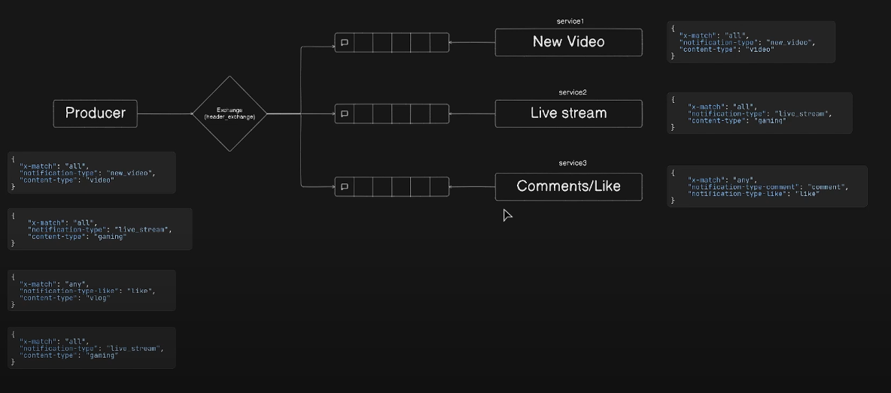

# RabbitMQ Headers Exchange Example

This project demonstrates how to use RabbitMQ **Headers Exchange** to route messages based on custom headers. It includes:

- A **Producer** that publishes messages with headers.
- Three **Consumer services** listening for different header combinations:
  - `New Video` notifications
  - `Live Stream` notifications
  - `Comments/Likes` notifications

## 📦 Tech Stack
- Node.js
- amqplib
- RabbitMQ

## 🧠 Concept
Instead of using `direct`, `fanout`, or `topic` exchanges, this uses `headers` for complex routing logic based on multiple keys like `notification-type`, `content-type`, etc.

## 🖼️ Architecture




## 🚀 Run Services

```bash
node producer.js      # Sends messages
node service1.js      # Listens for New Video
node service2.js      # Listens for Live Gaming Streams
node service3.js      # Listens for Likes & Comments
